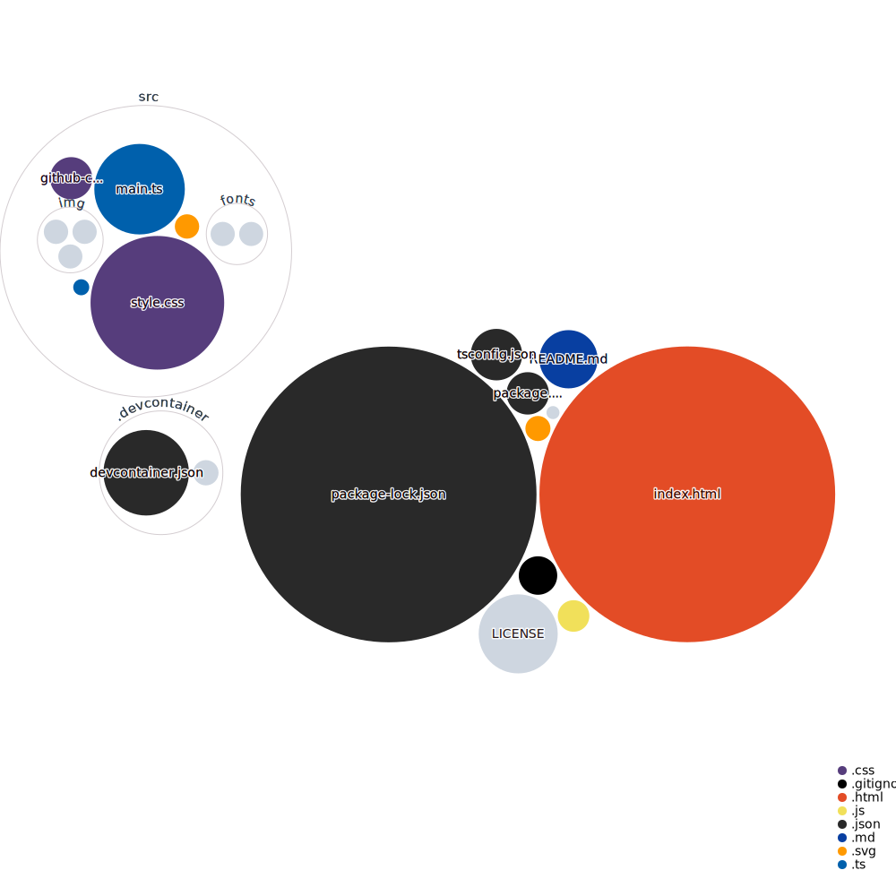

# Development server
Run `npm run dev` for a dev server. Navigate to `http://localhost:5173/`. The app will automatically reload if you change any of the source files.

# Build
Run `npm run build` to build the project. The build artifacts will be stored in the `dist/` directory.

# Pages

# Repo visualization

